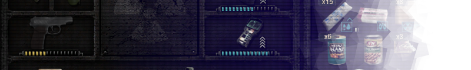
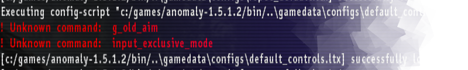
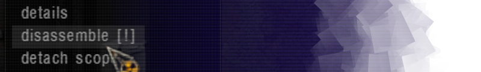
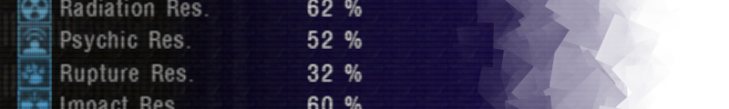
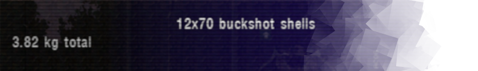
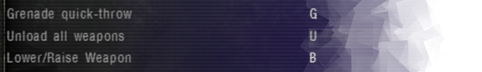

# Nitpicker's Modpack

A small collection of ~~OCD~~ QoL addons.

## BoltManager
Fixes the vanilla bolt manager which attempted to limit the number of bolts in player inventory but didn't work due to a bug.

## CharacterNameSaves
Renames auto-save files with character name (as opposed to computer user name) and level name. Creates quick saves with character name too.

## CrashesToRiches
Fixes crash with a specific WishGranter ending. May not work with some addons that introduce new items (if those addons are broken). 

## KeepBolts
Prevents player from moving bolts to bodies and stashes (where they would disappear after a game reload).

## KnifePistol
Double-clicking a pistol from the inventory equips the pistol in knife slot, if slot 2 is already occupied by something else.

## LogFixDefaultControls
The Ultimate Nitpick. Removes two unused settings from `default_controls.ltx` to prevent two warnings from being written into console log.   

## NoInventoryCloseDisassembly
Prevents closing the inventory window when disassembling items. Works with and without item animations.

## ReadWatch
Using the wrist watch displays the time in "human-speakable" format. Also none of that AM/PM nonsense.

## StatsDisplay
In item tooltips and detail views, displays numerical item stats instead of colored bars. 

## TotalWeights
Displays total weight of multi-use or stacked items in inventory tooltips.

## UnloadAll
Changes "unload all" key to only work when inventory is open. Also allows unloading all NPC weapons while looting.
